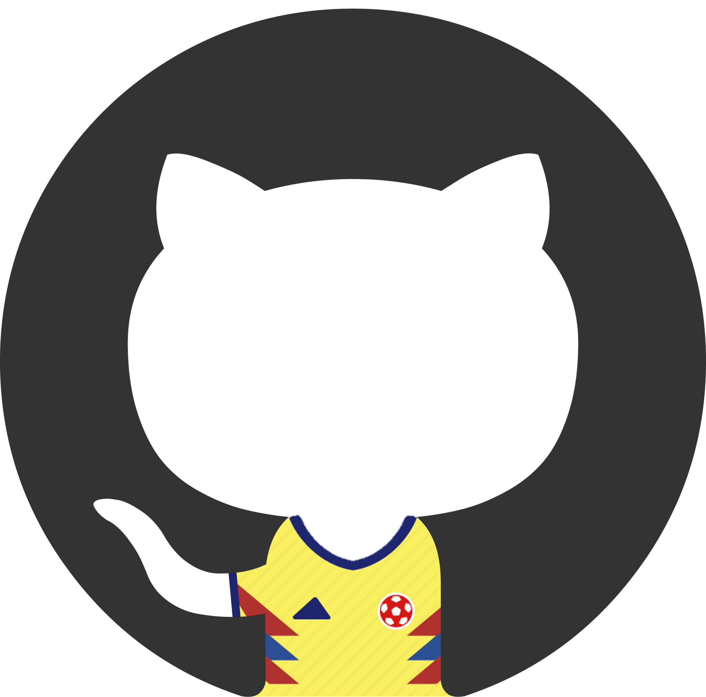

  

<h3 align="center">Graduate Research Assistant at VMASC-ODU  
  PhD Student in Computer Science at Old Dominion University  
  MS in Industrial Engineering from Universidad del Norte-Colombia  
  Machine Learning| NLP | Survey Research | Web Development  
</h3>

Hello there!💻 

I'm **Jhon G. Botello**🚀. ✨Welcome to my GitHub treasure trove of repositories!✨

<!--
Here are some ideas to get you started:

- 🔭 I’m currently working on ...
- 🌱 I’m currently learning ...
- 👯 I’m looking to collaborate on ...
- 🤔 I’m looking for help with ...
- 💬 Ask me about ...
- 📫 How to reach me: ...
- 😄 Pronouns: ...
- ⚡ Fun fact: ...
-->

<h3 align="left">Connect with me:</h3>

<h3 align="left">Languages and Tools:</h3>

       

